# opencv+cuda编译教程(windows)
测试环境: win10(21H1)+cmake(3.22.0-rc2)+Visual Studio 16 2019

## 前置准备

###1.下载opencv与opencv_contrib源码
   - opencv: https://github.com/opencv/opencv
   - opencv_contrib: https://github.com/opencv/opencv_contrib
   - **注意：版本必须对应**

###2.安装cuda与cudann
   - 根据自己的环境下载cuda并安装: https://developer.nvidia.com/cuda-toolkit-archive
   - 下载对应cuda版本的cudnn:https://developer.nvidia.com/rdp/cudnn-download
     - cudnn下载完成后,将压缩包解压,文件全都复制到cuda的安装目录下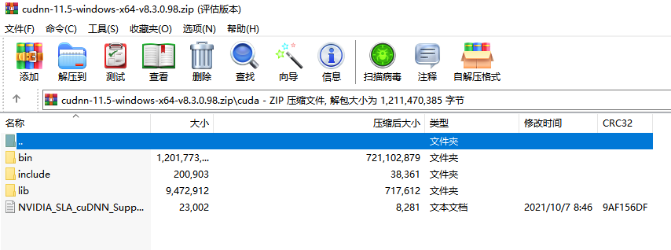
   - **cuda环境检查**
     - ```commandline
         nvcc -V
       ```
       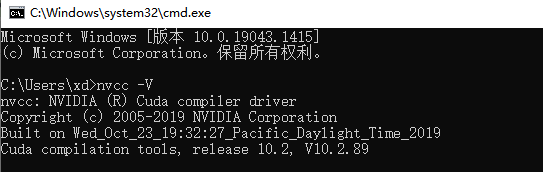
   - **cudnn环境检查**
     - 在cuda的安装路径下 ```extras\demo_suite```文件夹中,通过```deviceQuery.exe```
     来查看gpu状态
     - 在cmd中,运行```deviceQuery.exe```,重点关注红框划出的内容,代表了cuda当前的运行版本,以及运行结果
     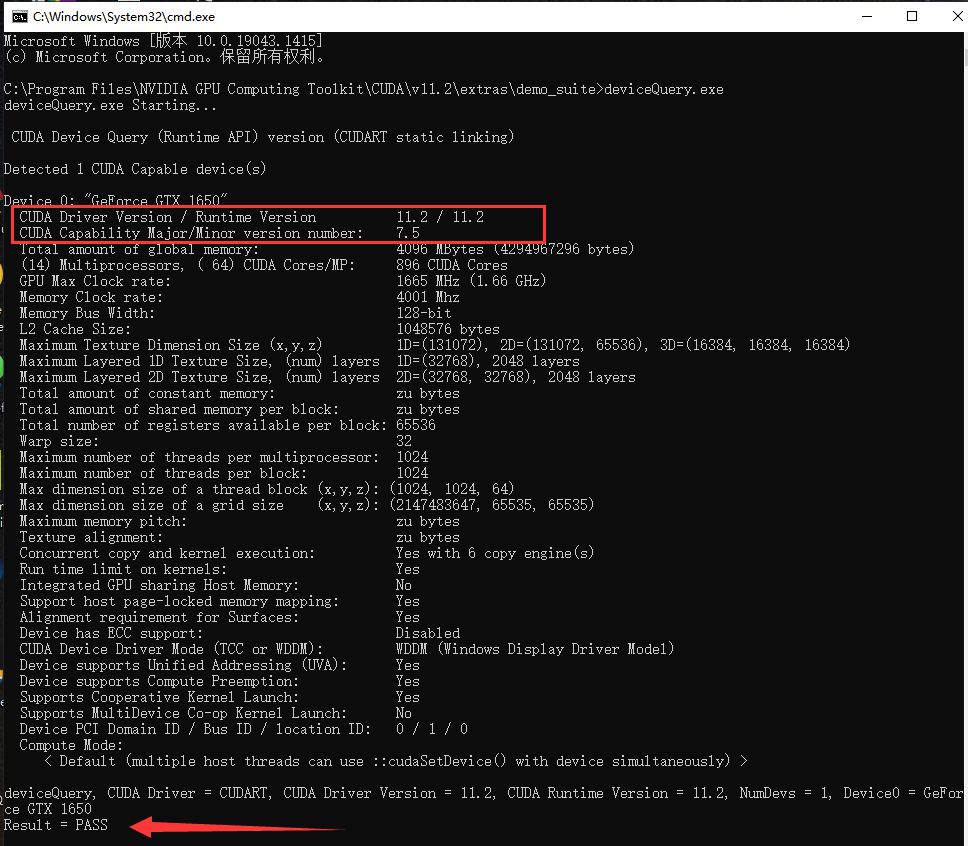
   - **环境变量检查**
     - 前面的检查都运行完成后,查看环境变量
       - 环境变量中,应该会存在对应版本的cuda路径
         1. 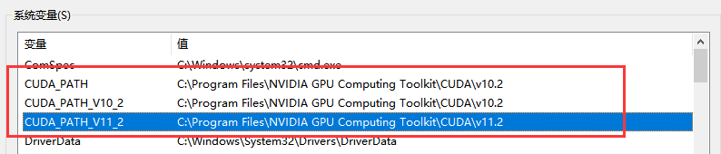
         2. 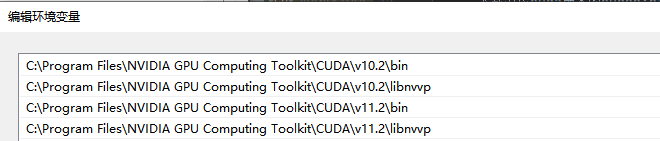
   
   - **全部配置完成后,建议重启一次**

### 下载Cmake
    - Cmake下载地址：https://cmake.org/download/


## Cmake编译opencv源码

1. 打开Cmake,选择opencv源码路径,与安装路径
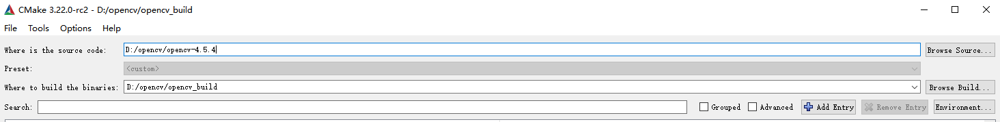
2. 点击"Configure",根据本机的visual Studio版本,选择相应的配置,点击Finish后,等待构建完成
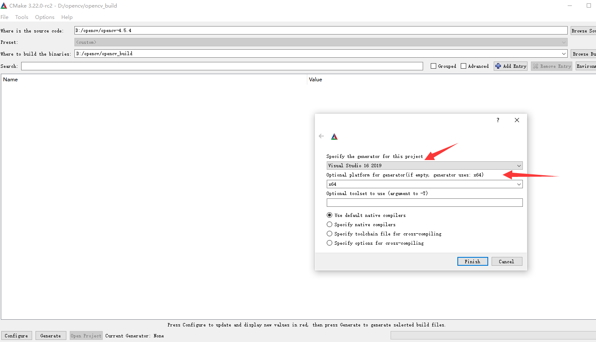
3. 配置选择
   1. Name ```OPENCV_EXTRA_MODULES_PATH```,配置路径到opencv_contrib的modules文件所在位置
   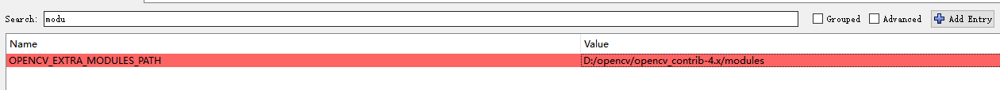
   2. 勾选cuda模块```WITH_CUDA```
   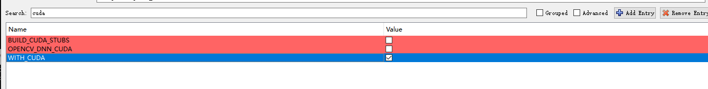
   3. python配置
      1. ```PYTHON3_EXECUTABLE```
      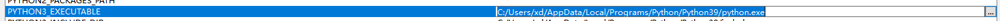
      2. ```PYTHONE3_INCLUDE_DIR```
      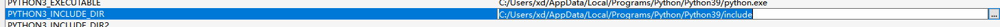
      3. ```PYTHON3_LIBRARY```
      
      4. ```PYTHON3_NUMPY_INCLUDE_DIRS```-numpy包的路径
      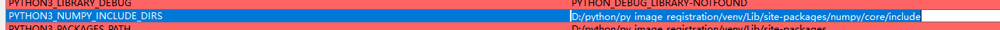
      5. ```PYTHON3_PACKAGES_PATH```-需要安装到的python虚拟环境路径
      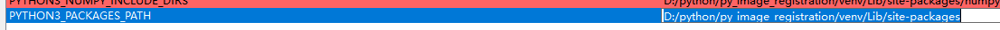
   4. 勾选```OPENCV_ENABLE_NONFREE```
   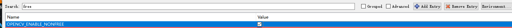
   5. 取消掉所有test,docs
   6. 点击"Configure",并等待构建完成
   7. 构建中,由于网络问题,有大概率在会出现报错,如下给出解决方案
      1. 在安装路径下,找到```CMakeDownloadLog.txt```文件,手动下载源地址文件
      
      2. 下载文件后,放入以下路径中,与同名文件替换,注意要修改文件名,加上对应的MD5值
      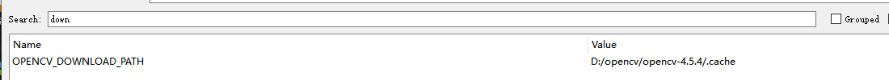
   8. 根据显卡算力,勾选相应的```CUDA_ARCH_BIN```
   https://developer.nvidia.com/cuda-gpus#collapseOne
   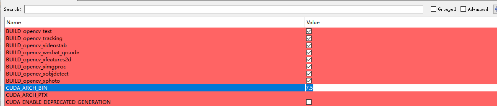
   9. 检查CUDA以及cuDNN配置情况(版本号与电脑环境一致)
   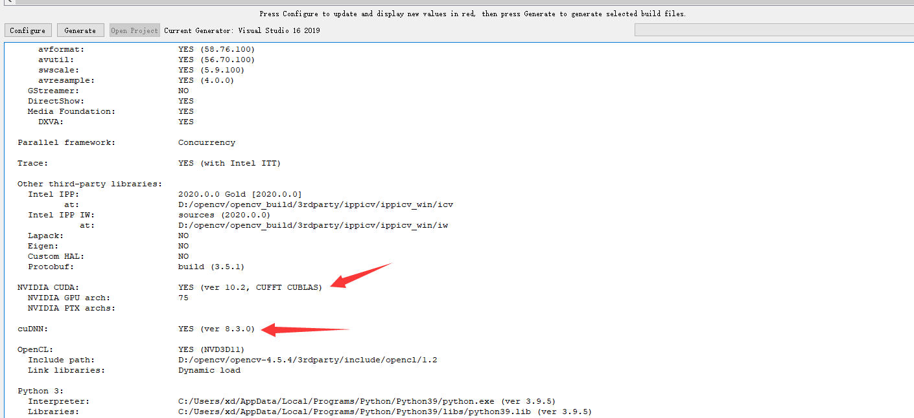
      1. 如果存在版本号与预期不符合,可以在```CUDA_TOOLKIT_ROOT_DIR```中更改cuda目录
   10. 以上操作完成后,点击"Generate"按钮,等待解决方案生成
4. Visual Studio编译
    1. 打开工程sln文件,选择编译环境为Release
    2. 右键```ALL_BUILD```,点击"生成",等待生成完毕
   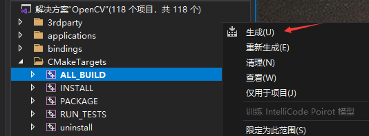
    3. 不出意外的话,生成全部成功
   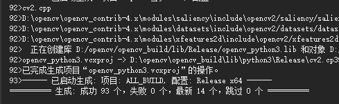
    4. ```ALL_BUILD```结束后,右键```INSTALL```,点击"生成",等待生成结束
   
    5. 结束后,会在```PYTHON3_PACKAGES_PATH```的路径中,生成图片中类似的目录
   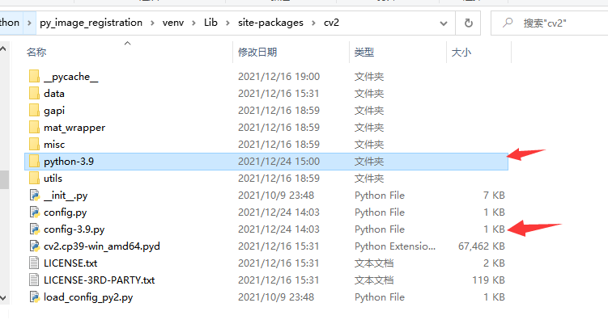
    6. 进入python环境中,验证安装完成
    ```python
   import cv2
   if cv2.cuda.getCudaEnabledDeviceCount() > 0:
        print("检测到cuda环境")
   ```